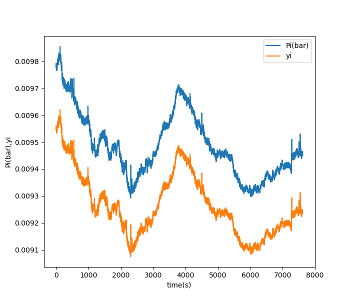

# Data logging and plotting

Cameron F Abrams cfa22@drexel.edu

1. `masonjar1/masonjar1.ino` -- simple Arduino sketch to capture data from a BME280 and echo to the serial port.
2. `csvlogger.py` captures data from the serial port and writes to a log.  When invoked it closes and then reopens the serial port, restarting the sketch on the Arduino.
   Example:
   ```
   > python csvlogger.py -p COM5 -o out.csv -bs 25
   ```
`bs` is the buffer size in lines.  This script will append to the designated output file this number of lines one block at a time.  It also expects there to be a line in the serial output from the Arduino that begins with `#LABELS` which is then followed by a list of column labels.

3. `plot.py` generates a plot from the output of `csvlogger.py`.  Example:
   ```
   > python plot.py -do-pp -f out.csv
   ```
   This generates a plot of water partial pressure and vapor-phase mole fraction vs time.  The plot will pop up in an interactive graphics window, and will also be saved as a PNG image (whose name you can specify with `-o name.png` and defaults to `plot.png`).  Other
   options include just plotting raw data by indicating which column(s) to plot:
   ```
   > python plot -f out.csv -y 3
   ```
   This will plot the RH vs time (since RH is in column 3; time is in column 0).
   If you want to know the column labels, just do this (it won't generate a plot):
   ```
   > python plot -f out.csv -echo-columns
   ```


Here's how I use these:
1. Load the sketch into the Arduino
2. Start the logger
3. Plot!

Here is an example plot:

